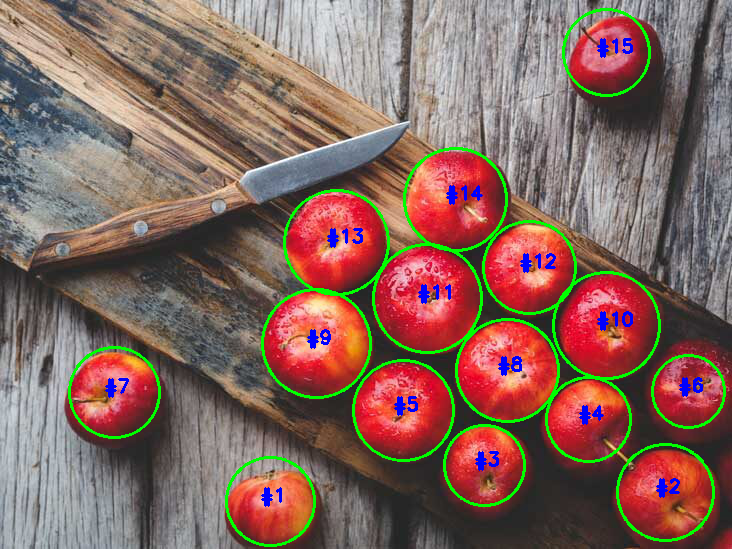
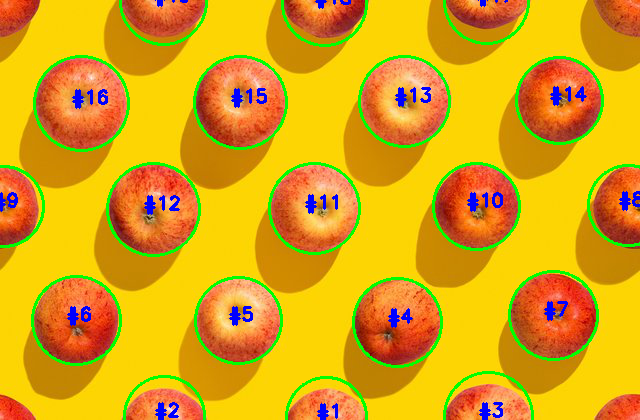
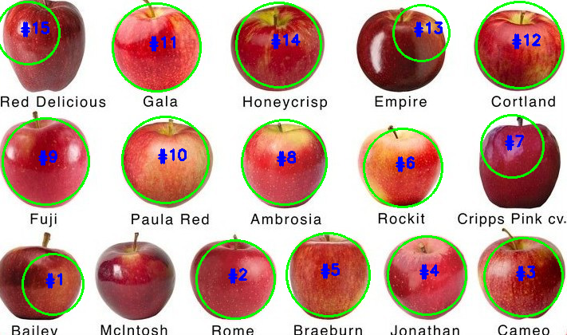

# AppleDetectionAndCounting
Detecting and Counting Apples in Real World Images using OpenCV and Python

Python scripts and images for my [blog post](https://shrishailsgajbhar.github.io/post/OpenCV-Apple-detection-counting). 

How to run:

* `python approach_1.py --image apples.png`
* `python approach_2.py --image apples.png`

**Sample outputs for the best approach:**

For more details refer the [blog post](https://shrishailsgajbhar.github.io/post/OpenCV-Apple-detection-counting).
